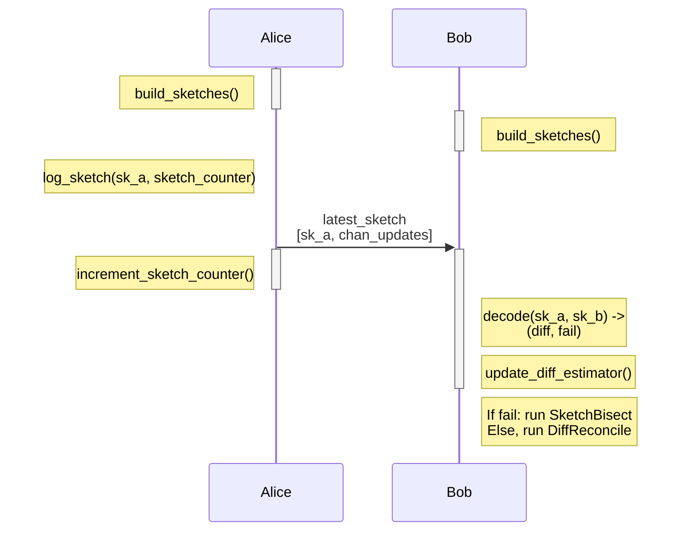
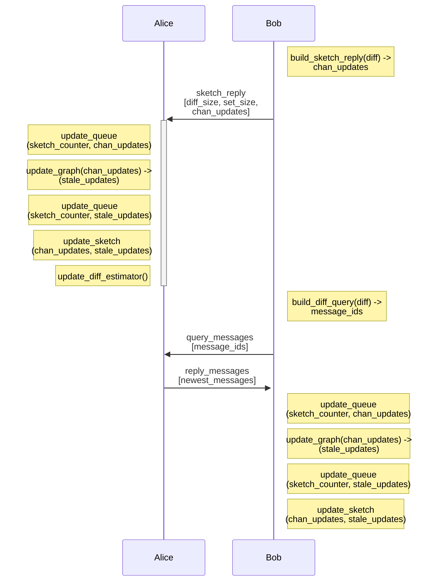
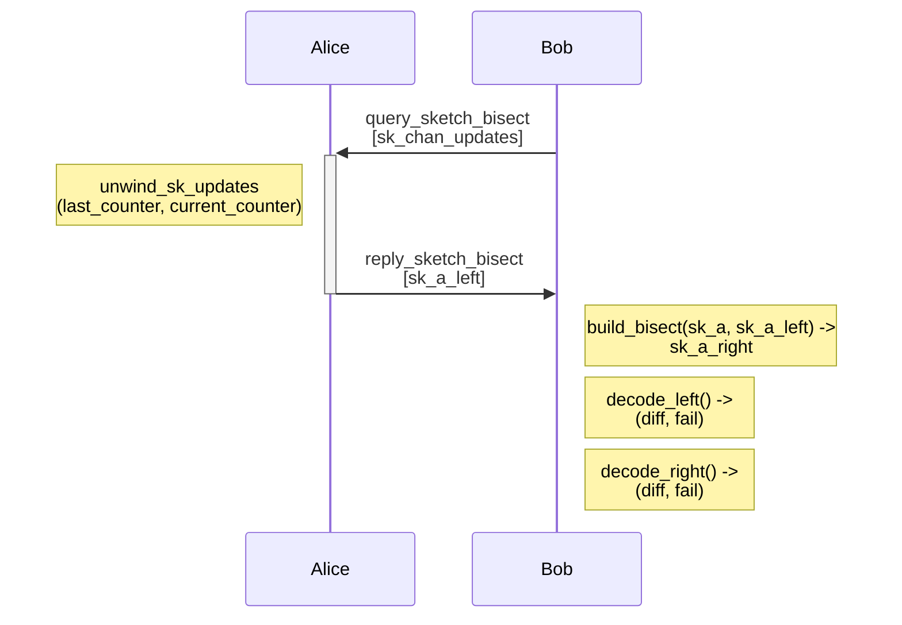

# Extension BOLT XX: Minisketch Gossip

This document specifies a P2P protocol extension for reconciliation of [Gossip v1.5](https://github.com/lightning/bolts/pull/1059) messages between 2 nodes. This extension is intended to replace to batched broadcast mechanism currently outlined in BOLT-7, which should allow increasing network connectivity and decreasing message propagation delay while also reducing total bandwidth cost.

The writing style does not strictly match the BOLT nor BIP styles.

# Table of Contents

* [Motivation](#motivation)
* [Terminology](#terminology)
* [Specification](#specification)
    * [Types](#types)
    * [Feature bits](#feature-bits)
    * [Data structures](#data-structures)
    * [Protocol Flow](#protocol-flow)
    * [Messages](#messages)
* [Appendix](#appendix)

## Motivation

The batched broadcast mechanism currently specified in BOLT-7 has a few characteristics that lead to practical issues with gossip message propagation around the network. First, bandwidth usage scales ~linearly both with the number of peer connections, and the network-wide rate of new messages. Prior work has found a **bandwidth cost** of 2.55 for 3 peer connections, and more recent work has found similar cost; 7.55 for 8 peer connections. Here, bandwidth cost is  `(size(transmitted data) / size(new messages))`. An ideal broadcast protocol would have a cost of 1; each node receives each message exactly once. The primary source of this cost is that peers forward _duplicate_ messages; messages that the receiver has already seen.

This high bandwidth cost leads to mitigations such as rate limits per connection and rotation of peer connections to try and receive 'diverse' gossip messages from across the network. In practice, messages have a **propagation delay** (the time to reach a certain percentage of the network) of 150 seconds for 50% of the network to see a message. More importantly, nodes often have a 'lagging' view of the network state, where messages are not received. This can lead to issues with payment route construction, such as overpayment of fees or failed payments due to stale feerates.

A **reconciliation-based protocol** promises lower bandwidth cost, lower propagation delay, and lower cost for improved network connectivity. Due to lower bandwidth cost per-connection, more connections can be maintained, which improves connectivity and propagation delay.

Prior work on reconciliation-based gossip protocols includes [Erlay](https://arxiv.org/pdf/1905.10518) and [BIP330](https://github.com/jharveyb/bips/blob/master/bip-0330.mediawiki), which address Bitcoin P2P transaction propagation. The underlying set reconciliation set reconciliation primitive used is [Minisketch](https://github.com/bitcoin-core/minisketch). This proposal differs significantly from Erlay, but also makes use of the Minisketch library.

By using flooding (announce a message you create to all current peers), set reconciliation (detect messages your peer has that you don't, and vice versa), and inventory messages (request unseen messages from your peer), this protocol enables rapid message propagation between nodes with a low bandwidth cost. At a high level:

* Maintain multiple sets, one per gossip message type (channel announcement, channel update, and node announcement). Each message has a unique 64-bit identifier, and these identifiers are uniformly distributed.
* Maintain multiple sketches over these sets, of varying capacities. These sketches are updated based on messages received or created.
* Regularly send sketches to your peers, who may perform set reconciliation with their own sketch. Your peers then forward you messages that either you do not have, or that are 'newer' than your matching message for a channel state or node.
* Your peer requests messages that they detect they do not have. They can then update their set and sketch with any 'newer' messages.
* If reconciliation fails, a peer may request a sketch bisection, which can allow then to successfully decode the original sketch. Otherwise, you can send them a larger sketch in the future.
* When you create a new gossip message, flood it to your peers, such that it does not introduce a difference during the upcoming set reconciliation round.

## Terminology

Minisketch is an implementation of PinSketch, a BCH-based secure sketch. It can be thought of as a 'set checksum' where:

* Sketches have a fixed capacity and element size, determined upon creation. When the number of elements is smaller than the set capacity, the entire set can be recovered by decoding the sketch. A sketch of _b_-bit elements and capacity _c_ can be stored in _bc_ bits.
* A sketch of the symmetric difference between two sets (elements are in one set but not both) can be created by combining the sketches of each set.
* Sketches are added by _merging_, which is just XOR.
* Adding elements to a sketch is extremely fast, and has complexity `O(bc)`.
* Elements are removed from a sketch by re-adding them to the sketch (think of XOR).
* For a sketch of a symmetric difference, decoding the sketch has complexity `O(b*d^2)`, where `d` is the number of differences.

Sketch bisection is described further below; it allows decode of a sketch A (created from some set B, split into B_left and B_right),to be retried after receiving a secondary sketch A' of size len(A)/2. A' is created from a subset of the original set B.

## Specification

### Types

#### Messsage IDs

We can uniquely identify _most_ gossip V2 messages as follows:

`channel_update_id_preimage`:

1. Most significant 3 bytes = Block height of channel funding TX
2. Next 15 bits = TX index in a block
3. Next 13 bits = Output number in the TX
4. Next bit = Channel update direction
5. Last 11 bits = Block number of this message, in the range [0,2016]

For TXs with index > 2^15 / 32768, or output index > 2^13, the message cannot be added to the set.

`channel_announcement_id_preimage`:

1. Most significant 3 bytes = Block height of channel funding TX
2. Next 16 bits = TX index in a block
3. Next 13 bits = Output number in the TX
4. Last 11 bits = Block number of this message, in the range [0,2016]

`node_announcement_id_preimage`:

Reuse `channel_update_id_preimage`, where the direction bit signifies `node_i` vs. `node_2`.

##### Rationale

We need per-message IDs that differ from those in the taproot-gossip BOLT, or existing IDs like the short channel ID / SCID, since those do not include data about the new rate-limiting behavior for Taproot gossip / gossip v1.5. The publishing block number also provides an ordering for messages referring to the same channel; a message with a higher block number than a message with a lower block number. This replaces the BOLT-7 behavior of comparing messages based on their timestamp, but here we need that information to be available after sketch reconciliation, and before the transmission of actual messages (to save on bandwidth).

#### Sketch set elements

For each `*id_preimage` type, there is a corresponding `*_sketch_id` type, which is a different 64-bit value:

`1 + (mx3_v2(*_id_preimage) mod 0xFFFFFFFFFFFFFFFF)`

##### Rationale

The [mx3 mixer](https://jonkagstrom.com/mx3/mx3_rev2.html) is used as a non-DoS-resistant hash function for some hashmaps. It has the useful property that it is _invertible_, so `*id_preimage` can be computed from `*_sketch_id`. Since each `*_id_preimage` is unique by definition (each channel is tied to exactly one UTXO), there is no risk of collision. Using mx3 makes our sketch IDs uniformly distributed over the set of all 64-bit values, which is needed for sketch bisection. We add 1 to the mx3 output to ensure that there is no 0-valued `*_sketch_id`, which is a requirement for elements in a Minisketch input set.

The mx3 function is fast to compute, as it only uses multiply, XOR, and shift operations. It is the curent `boost::hash` function for some of the Boost [containers](https://www.boost.org/doc/libs/latest/libs/container_hash/doc/html/hash.html#recent_boost_1_81_0).

For the specific case of exactly one round of sketch bisection, we actually only need to split the input set in half. In that case, we could also use some simpler mapping from message IDs to sketches, such as XORing the least significant bit of the channel funding TX, TX index, and message block number. Both of these options are equally DoS-vulnerable for message publishers that don't need to use every single block number to publish updates (they could choose to cause many sketch differences in one half of the input set for sketches, instead of evenly / randomly across the input set.) I think this is a tradeoff inherent to having a public message->set element mapping instead of per-peer mappings.

#### Reconciliation counter

Tracking the time ordering of sent sketches and received messages enables cheap sketch bisection for previously-sent sketches. A node should maintain a large monotonic counter that is incremented when a sketch is sent, and used as a 'tag' for recently received or removed messges.

`reconciliation_counter` = uint64

Set to 0 on node startup.

#### Feature Bits

XXX/XXX+1 = `option_gossip_reconciliation`

### Data Structures

A node maintains `n*2*3` sketches, with `n` per messsage type. We have 3 message types, and we split the input set in two to enable bisection. The input set for these sketches is the `sketch_id` of messages of that type. When `n` > 1, this enables cheap transmission of larger sketches in case of decode failure or higher rates of global message production. E.x. `n = 3`, and the 3 sketch sizes / capacities are 32, 256, and 1536 elements. These values do not need to strictly match across implementations, but the maximum number of differences that are recoverable for a reconciliation is `min(len(A), len(B))`, so a node should maintain at least one high-capacity sketch.

A node also maintains an ordered list of added and removed sketch IDs `sketch_update_queue`, represented as (`*_sketch_id`, `reconciliation_counter`, `reconciliation_counter`). Before a newly received message is added to a node's sketch input set or sketch, it must be appended to this list with the current `reconciliation_counter` value. If a message is removed from the input set, the `reconciliation_counter` value at removal time must be set. This list can be 'trimmed' based on the difference between the current counter value, and a messages add/remove time; messages that have been present in the set for 1 hour, or were removed an hour ago, will not need to be added nor removed from a sketch for bisection, and so can be removed from this list.

When reconstructing a sketch for bisection, a node can use this list to determine which updates occured since the original sketch was sent to the peer requesting bisection, and then 'undo' those updates and send the bisection reply. Without this 'undo' step, any updates to the sketch since the original transmission would appear as differences, which could cause bisection to fail.

#### Rationale

Maintaining sketches per message type helps to keep message IDs at 64 bits, which is important for sketch decode performance. Sketch operations are faster for specific element sizes, and 64 bits is a well-supported size for a SIMD lane / input value for instructions such as CLMUL and PMULL, which accelerate math operations that are critical for sketch decode.

By maintaining two sets for a given sketch capacity, less computation is need to handle bisection; there is no need to build a new sketch. E.x. for the sketch capacity of 256, maintain two sketches of capacity 256, one (sketch A), for elements with `sketch_id < 0x8FFFFFFFFFFFFFFF`, and the other (sketch B) for the remaining elements.

To build the final sketch, combine sketches A and B: `sketch_C = sketch_A XOR sketch_B`. If decode fails, just apply 'undo' operations to `sketch_A` and send that; the sketch operation count you need to send a bisection reply scales with message arrival rate, but not input set size. An alternative would be rebuilding `sketch_A` on the fly, which would take a significant amount of time for 1e5+ elements.

### Protocol Flow

SketchReceive:

Initially, Alice and Bob both compute the message_ids for all gossip messages they had locally. With that set of message_ids, they can build sketches. Before sending a sketch, Alice records the current sketch_counter. After sending the sketch, Alice increments her local sketch_counter.

When Bob receives a sketch, he'll merge with his sketch for the same message type and attempt to decode. If decode succeeds, Bob moves to DiffReconcile to update Alice and receive updates. Otherwise, he moves to SketchBisect. Either way, he updates his local difference estimator.

DiffReconcile:

From the sketch difference, Bob compares those message IDs to his set of message_ids to determine which messages he has that are newer than Alice's messages for the same channel or node (graph object), and vice versa. Bob sends Alice his newest messages for these objects; they may be newer that the IDs that were inputs for the original sketch, since he may have received even newer messages from another peer.

While Alice updates her local state, Bob also requests updates for objects where Alice had the newer message. Once Alice replies, Bob can update his local queue, set, and sketch.

If the sketch decode failed, Bob proceeds to SketchBisect:

If any decode operation succeeds, Bob proceeds with DiffReconcile. For failed decodes, Bob must send a sketch_reply with diff_fail set. This allows Alice to update her diff estimator and send Bob a higher capacity sketch in the next reconciliation round.

#### Difference Estimation

For each P2P connection, each party must choose what capacity sketch to send for the next reconciliation round. By tracking the difference size from the last round, as well as if sketch decode succeeded at all, we can adjust the sketch size to respond to traffic increases (or having a well-connected peer).

If `D = last_round_differences`, `c = min_sketch_size`, `e = last_round_sketch_size` and `k = abs(local_set_size - remote_set_size)` , our next sketch size can be:

`d = k + D + c`

if reconciliation succeeded. Set `d = e*2`, or the next nearest larger sketch size if reconciliation failed.

This estimator can be refined by integrating observed `D` over multiple rounds using an exponentially-weighted moving average similar to RFC 6298, the TCP Retransmission Timeout (RTO) estimator.

#### Propagating New Messages

If a node is creating new messages, they must rate-limit their sketch updates such that they are able to send a sketch to a peer that would decode successfully. For example, if a node is maintaining a largest channel_updates sketch of 512 elements, and they have 1536 channels, they should make a maximum of 511 updates to this sketch before the next scheduled transmission of this sketch.

In practice, the rate of sketch updating should be much lower to prevent decode issues for future network hops. Nodes can target a rate of sketch updates based on their observed difference rates, plus their observed unique message arrival rates from existing peers. Given existing traffic patterns, scheduling messages to be added to a sketch over 120 seconds should be sufficient.

To further reduce sketch decodes, message creators should flood their messages to their direct peers, at the time of sketch addition and on the same schedule. This avoids one difference per new message, with all peers of the message creator.

### Messages

#### `latest_sketch` / `reply_sketch`

1. type: XXX, `latest_sketch`
2. data:
    * `byte`: sketch_encoding (0 = Minisketch)
    * `byte`: message_type (bitfield)
    * `u16`: len
    * `len*8*byte`: encoded_sketch

Message type is one of channel_update, channel_announcement, or node_announcement. The sketch encoding field is used to support future sketch versions (different element size, or sketch algorithm).

1. type: XXX, `reply_sketch`
2. data:
    * `u32`: set_size
    * `bool`: diff_success
    * `reply_sketch_tlvs`: tlvs

1. `tlv_stream`: reply_sketch_tlvs
2. types:
    1. type: 1 (`diff_size`)
    2. data:
        * `u16`: diff_size
    
    1. type: 3 (`bisect_request`)
    2. data:
        * `byte`: sketch_encoding (0 = Minisketch)
        * `byte`: sketch_type (bitfield)

The actual reply gossip batches are sent in a batch.

#### `query_messages`

1. type: XXX, `query_messages`
2. data:
    * `byte`: message_type (bitfield)
    * `u16`: len
    * `len*8*byte`: message_ids

Explicitly specifying the message_type is needed in cases where message of different types can have the same message_id; for example, a channel_announcement and channel_update sent with the same blocknumber as the broadcast time.

The gossip messages sent as replies are sent in a batch.

#### `query_sketch_bisect` / `reply_sketch_bisect`

Querying for sketch bisect is part of reply_sketch.

1. type: XXX, `reply_sketch_bisect`
2. data:
    * `byte`: sketch_encoding (0 = Minisketch)
    * `byte`: message_type (bitfield)
    * `u16`: len
    * `len*8*byte`: encoded_sketch

### Appendix