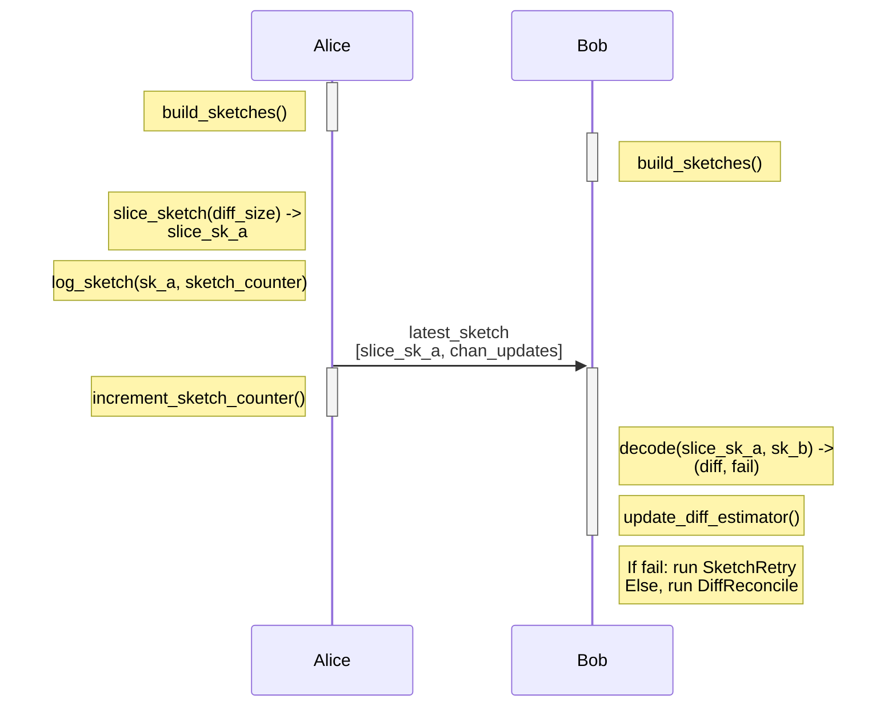
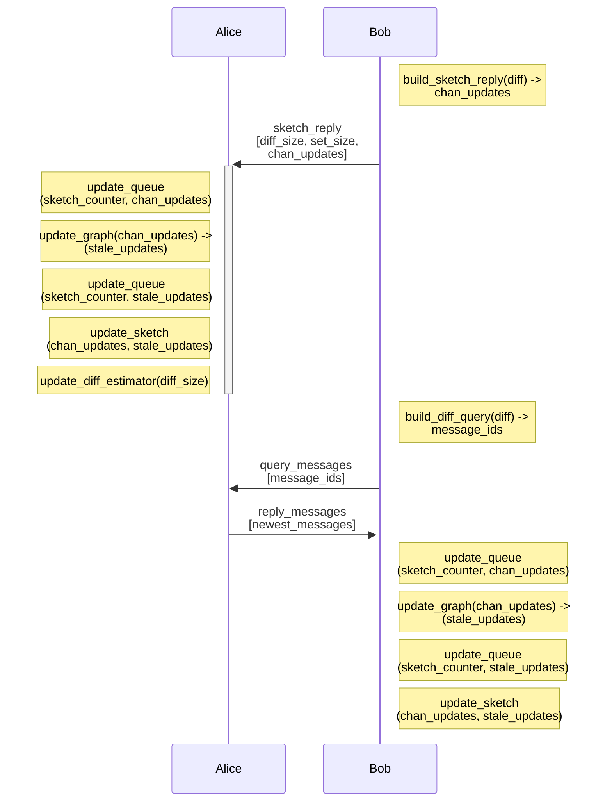
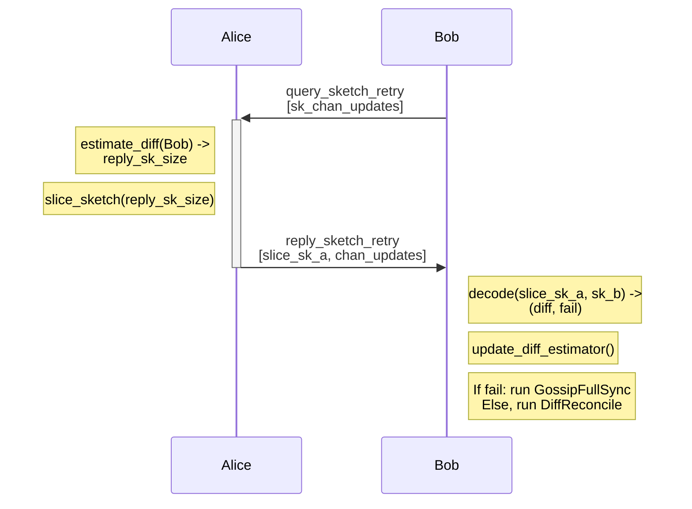

# Extension BOLT XX: Minisketch Gossip

This document specifies a P2P protocol extension for reconciliation of [Gossip v1.5](https://github.com/lightning/bolts/pull/1059) messages between 2 nodes. This extension is intended to replace to batched broadcast mechanism currently outlined in BOLT-7, which should allow increasing network connectivity and decreasing message propagation delay while also reducing total bandwidth cost.

The writing style does not strictly match the BOLT nor BIP styles.

# Table of Contents

* [Motivation](#motivation)
* [Terminology](#terminology)
* [Specification](#specification)
    * [Types](#types)
    * [Feature bits](#feature-bits)
    * [Data structures](#data-structures)
    * [Protocol Flow](#protocol-flow)
    * [Messages](#messages)
* [Appendix](#appendix)

## Motivation

The batched broadcast mechanism currently specified in BOLT-7 has a few characteristics that lead to practical issues with gossip message propagation around the network. First, bandwidth usage scales ~linearly both with the number of peer connections, and the network-wide rate of new messages. Prior work has found a **bandwidth cost** of 2.55 for 3 peer connections, and more recent work has found similar cost; 7.55 for 8 peer connections. Here, bandwidth cost is  `(size(transmitted data) / size(new messages))`. An ideal broadcast protocol would have a cost of 1; each node receives each message exactly once. The primary source of this cost is that peers forward _duplicate_ messages; messages that the receiver has already seen.

This high bandwidth cost leads to mitigations such as rate limits per connection and rotation of peer connections to try and receive 'diverse' gossip messages from across the network. In practice, messages have a **propagation delay** (the time to reach a certain percentage of the network) of 150 seconds for 50% of the network to see a message. More importantly, nodes often have a 'lagging' view of the network state, where messages are not received. This can lead to issues with payment route construction, such as overpayment of fees or failed payments due to stale feerates.

A **reconciliation-based protocol** promises lower bandwidth cost, lower propagation delay, and lower cost for improved network connectivity. Due to lower bandwidth cost per-connection, more connections can be maintained, which improves connectivity and propagation delay.

Prior work on reconciliation-based gossip protocols includes [Erlay](https://arxiv.org/pdf/1905.10518) and [BIP330](https://github.com/jharveyb/bips/blob/master/bip-0330.mediawiki), which address Bitcoin P2P transaction propagation. The underlying set reconciliation set reconciliation primitive used is [Minisketch](https://github.com/bitcoin-core/minisketch). This proposal differs significantly from Erlay, but also makes use of the Minisketch library.

By using flooding (announce a message you create to all current peers), set reconciliation (detect messages your peer has that you don't, and vice versa), and inventory messages (request unseen messages from your peer), this protocol enables rapid message propagation between nodes with a low bandwidth cost. At a high level:

* Maintain multiple sets, one per gossip message type (channel announcement, channel update, and node announcement). Each message has a unique 64-bit identifier, and these identifiers are uniformly distributed.
* Maintain a single large sketch over each set. These sketches are updated based on messages received or created.
* Regularly send slices of these large sketches to your peers, who may perform set reconciliation with their own sketch. Your peers then forward you messages that either you do not have, or that are 'newer' than your matching message for a channel state or node.
* Your peer requests messages that they detect they do not have. They can then update their set and sketch with any 'newer' messages.
* If reconciliation fails, a peer may request a larger slice of a sketch, and re-attempt set reconciliation.
* When you create a new gossip message, flood it to your peers, such that it does not introduce a difference during the upcoming set reconciliation round.
* If reconciliation fails after sending a larger sketch, fall back to requesting messages based on timestamp, or sending the full gossip graph.

## Terminology

Minisketch is an implementation of PinSketch, a BCH-based secure sketch. It can be thought of as a 'set checksum' where:

* Sketches have a fixed capacity and element size, determined upon creation. When the number of elements is smaller than the set capacity, the entire set can be recovered by decoding the sketch. A sketch of _b_-bit elements and capacity _c_ can be stored in _bc_ bits.
* A sketch of the symmetric difference between two sets (elements are in one set but not both) can be created by combining the sketches of each set.
* Sketches are added by _merging_, which is just XOR.
* Adding elements to a sketch is extremely fast, and has complexity `O(bc)`.
* Elements are removed from a sketch by re-adding them to the sketch (think of XOR).
* For a sketch of a symmetric difference, decoding the sketch has complexity `O(b*d^2)`, where `d` is the number of differences.

## Specification

### Types

#### Messsage IDs

We can uniquely identify _most_ gossip V2 messages as follows:

`channel_update_sketch_id`:

1. Most significant 3 bytes = Block height of channel funding TX
2. Next 15 bits = TX index in a block
3. Next 13 bits = Output number in the TX
4. Next bit = Channel update direction
5. Last 11 bits = Block number of this message, in the range [0,2016]

For TXs with index > 2^15 / 32768, or output index > 2^13, the message cannot be added to the set.

`channel_announcement_sketch_id`:

1. Most significant 3 bytes = Block height of channel funding TX
2. Next 16 bits = TX index in a block
3. Next 13 bits = Output number in the TX
4. Last 11 bits = Block number of this message, in the range [0,2016]

`node_announcement_sketch_id`:

Reuse `channel_update_sketch_id`, where the direction bit signifies `node_1` vs. `node_2`.

##### Rationale

We need per-message IDs that differ from those in the taproot-gossip BOLT, or existing IDs like the short channel ID / SCID, since those do not include data about the new rate-limiting behavior for Taproot gossip / gossip v1.5. The publishing block number also provides an ordering for messages referring to the same channel; a message with a higher block number is newer than a message with a lower block number. This replaces the BOLT-7 behavior of comparing messages based on their timestamp. Here, we need that information to be available after sketch reconciliation, and before the transmission of actual messages, to save on bandwidth.

#### Reconciliation counter

A node should maintain a large monotonic counter that is incremented when a sketch is sent, and used as a 'tag' for recently received or removed messges.

`reconciliation_counter` = uint64

Set to 0 on node startup.

#### Feature Bits

XXX/XXX+1 = `option_gossip_reconciliation`

### Data Structures

A node maintains 3 sketches; one per messsage type. The input set for these sketches is the `sketch_id` of messages of that type. Each sketch should have a capacity of at least 1024 elements. This capacity value is separate from the transmitted sketch size, which should be much smaller under normal network conditions. This 'internal' sketch capacity limits the maximum size of the sketch sent in reply to a reconciliation failure message. The internal capacity does not need to strictly match across implementations, but implementations must adhere to this minimum value. See the Appendix for justification for choosing this specific sketch capacity value.

A node also maintains an ordered list of added and removed sketch IDs, `sketch_update_queue`, represented as (`*_sketch_id`, `reconciliation_counter`, `reconciliation_counter`). Before a newly received message is added to a node's sketch input set or sketch, it must be appended to this list with the current `reconciliation_counter` value. If a message is removed from the input set, the `reconciliation_counter` value at removal time must be set. This list can be 'trimmed' based on the difference between the current counter value, and a messages' add/remove time; messages that have been present in the set for 1 hour, or were removed an hour ago, will not need to be added nor removed from a sketch used for any post-reconciliation sub-protocol, and so can be removed from this list.

Note that this update queue is not needed when replying to a peer after a reconciliation failure; the replying peer should send a slice of their current internal sketch.

#### Rationale

Maintaining sketches per message type helps to keep message IDs at 64 bits, which is important for sketch decode performance. Sketch operations are faster for specific element sizes, and 64 bits is a well-supported size for a SIMD lane / input value for instructions such as CLMUL (x86-64) and PMULL (ARM), which accelerate math operations that are critical for sketch decode. In general, sketch operation runtime scales `O(n^3)` with sketch element size.

### Protocol Flow

SketchReceive:

Initially, Alice and Bob both compute the message_ids for all gossip messages they have locally. With that set of message_ids, they can build sketches. Before sending a slice of her sketch, Alice records the current sketch_counter. After sending the sketch slice, Alice increments her local sketch_counter.

When Bob receives a sketch slice, he'll merge with his sketch for the same message type and attempt to decode. If decode succeeds, Bob moves to DiffReconcile to update Alice and receive updates. Otherwise, he moves to SketchRetry. Either way, he updates his local difference estimator.

DiffReconcile:

From the sketch difference, Bob compares those message IDs to his set of message_ids to determine which messages he has that are newer than Alice's messages for the same channel or node (graph object), and vice versa. Bob sends Alice his newest messages for these objects; they may be newer that the IDs that were inputs for the original sketch, since he may have received even newer messages from another peer.

While Alice updates her local state, Bob also requests updates for objects where Alice had the newer message. Once Alice replies, Bob can update his local queue, set, and sketch.

If the sketch decode failed, Bob proceeds to SketchRetry:

Alice uses her difference estimator instance for Bob to compute how many elements she should include the sketch slice she sends as a reply to Bob's retry request.

If sketch decode now succeeds for Bob, he proceeds with DiffReconcile. For failed decodes, Bob must send a sketch_reply with diff_fail set. This allows Alice to update her diff estimator and send Bob a higher capacity sketch in the next reconciliation round. Bob should then fall back to other queries to catch-up to the latest gossip state, such as timestamp queries or requesting the full gossip graph.

Independent of Bob's future queries to Alice, he should also update his difference estimator such that he will send Alice a larger sketch slice for their next reconciliation round.

#### Difference Estimation

For each P2P connection, each party must choose what capacity sketch slice to send for the next reconciliation round. By tracking the difference size from the last round, as well as if sketch decode succeeded at all, we can adjust the sketch size to respond to traffic increases (or having a well-connected peer).

If `D = last_round_differences`, `c = min_sketch_size`, `e = last_round_sketch_size` and `k = abs(local_set_size - remote_set_size)`, our next sketch size can be:

`d = k + D + c`

if reconciliation succeeded. If reconciliation failed, set `d' = min(d*3, sketch_capacity)`, where `d'` is the value used for the sketch retry reply. If reconciliation retry failed, set `d'' = sketch_capacity`.

This estimator can be refined by integrating observed `D` over multiple rounds using an exponentially-weighted moving average similar to RFC 6298, the TCP Retransmission Timeout (RTO) estimator.

#### Propagating New Messages

If a node is creating new messages, they must rate-limit their sketch updates such that they would expect the next sketch slice they send to a peer to be decoded successfully. For example, consider a node with an internal sketch capacity of 1024 for their channel_updates sketch, that also has 1536 open channels. They must not update the fee policy for all channels in their sketch input set in between two rounds of sketch transmission.

In practice, the rate of sketch updating should be much lower to prevent decode issues for future network hops. Nodes can target a rate of sketch updates based on their observed difference rates, plus their observed unique message arrival rates from existing peers. Given existing traffic patterns, input set updates should be limited to batches of at most 128 messages bewtween sketch transmission rounds. With a round interval of 30 seconds, large nodes should be able to propagate channel_updates for a significant portion of their channels quickly and without causing decode failures for peers of peers.

To further reduce sketch differences, message creators should flood their messages to their direct peers, at the time of sketch addition and on the same schedule. This avoids one difference per new message with all peers of the message creator.

### Messages

#### `latest_sketch` / `reply_sketch`

1. type: XXX, `latest_sketch`
2. data:
    * `byte`: sketch_encoding (0 = Minisketch)
    * `byte`: message_type (bitfield)
    * `u16`: len
    * `len*8*byte`: encoded_sketch

Message type is one of channel_update, channel_announcement, or node_announcement. The sketch encoding field is used to support future sketch versions (different element size, or sketch algorithm).

1. type: XXX, `reply_sketch`
2. data:
    * `u32`: set_size
    * `bool`: diff_success
    * `reply_sketch_tlvs`: tlvs

1. `tlv_stream`: reply_sketch_tlvs
2. types:
    1. type: 1 (`diff_size`)
    2. data:
        * `u16`: diff_size
    
    1. type: 3 (`retry_request`)
    2. data:
        * `byte`: sketch_encoding (0 = Minisketch)
        * `byte`: sketch_type (bitfield)

The actual reply gossip batches are sent in a batch.

#### `query_messages`

1. type: XXX, `query_messages`
2. data:
    * `byte`: message_type (bitfield)
    * `u16`: len
    * `len*8*byte`: message_ids

Explicitly specifying the message_type is needed for cases where message of different types can have the same message_id; for example, a channel_announcement and channel_update sent with the same blocknumber as the broadcast time.

The gossip messages sent as replies are sent in a batch.

#### `query_sketch_retry` / `reply_sketch_retry`

Querying for sketch retry is part of reply_sketch.

1. type: XXX, `reply_sketch_retry`
2. data:
    * `byte`: sketch_encoding (0 = Minisketch)
    * `byte`: message_type (bitfield)
    * `u16`: len
    * `len*8*byte`: encoded_sketch

### Appendix
